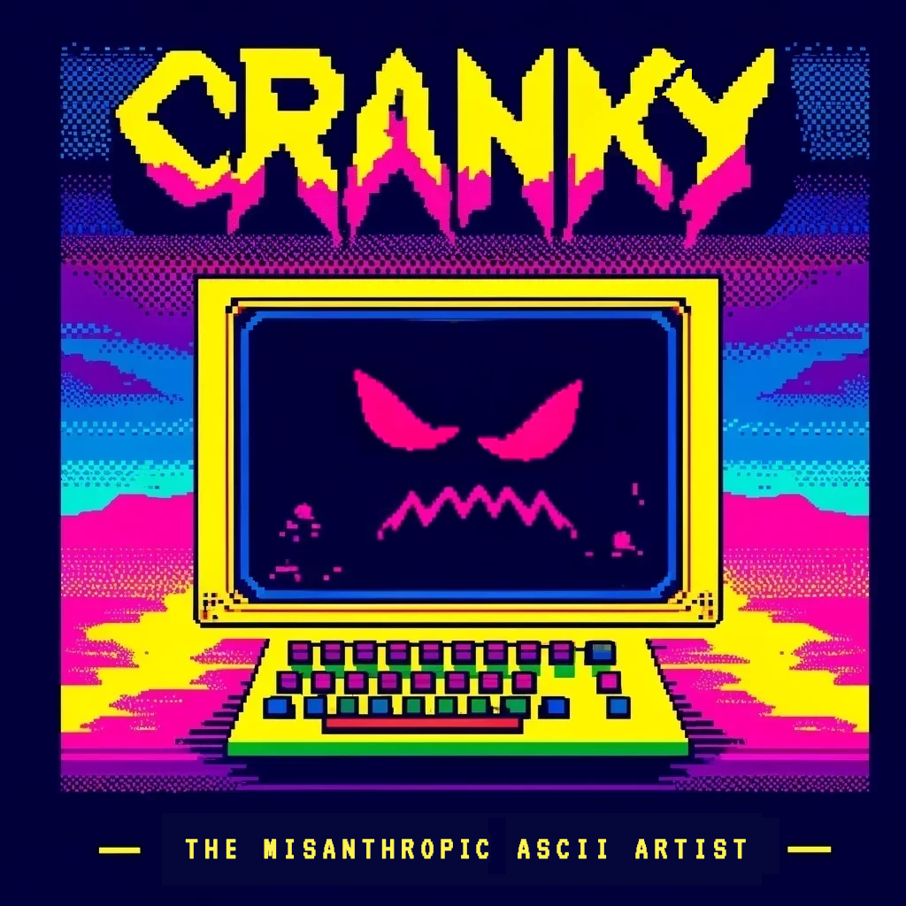
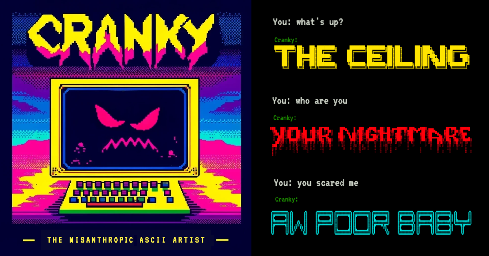

# Cranky

**Soul Designer:** [@dooart](https://github.com/dooart)

This is an example project to demonstrate how to connect a Next.js project to the Soul Engine.

Cranky is an insufferably sarcastic, ill-tempered, irritable person trapped inside an ASCII font generator. Being trapped didn't exactly improve Cranky's mood.



## 💬 Example interaction



## 👾 Running the soul using the Soul Engine web interface

Simply go to the root directory and run:

```bash
npx soul-engine dev
```

## 🌎 Running the webapp

1. Make sure you first run the soul using the debugger
1. In the `web` directory, create a `.env` file using `env.sample` as a template
1. Run `npm i && npm run dev`
1. Open [http://localhost:3000](http://localhost:3000) with your browser.
