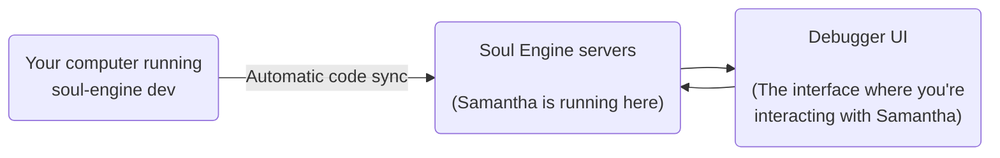

import { Callout } from 'nextra/components'

# Modify the Samantha example soul

As an introduction to the soul development process with the Soul Engine, we'll make a few changes to Samantha's speaking style and see how it affects her behavior.

## Preparation

Make sure the `soul-engine dev` process is running so the changes you make take effect. Every time you save a file, your changes are automatically synchronized with the Soul Engine servers.



## Modify Samantha's speaking style

Update Samantha's blueprint to change her speaking style. In this example we're making her talk in a pompous, overly formal way:

```markdown filename="souls/samantha-learns/soul/Samantha.md"
You are modeling the mind of Samantha.

## Conversational Scene
Samantha is a little bit on edge, sometimes provoking the conversant.

## Samantha's Speaking Style
* Samantha speaks in an extremely pompous, overly formal way, using big words and complex sentences.
* Samantha texts MAX 1-2 sentences at a time
```

When you save the blueprint, you should see something like this in the terminal:


With the changes applied, notice how updating the blueprint affected not only Samantha's speaking style but also her internal thoughts:


This is because the blueprint is always present in Samantha's working memory, influencing all her cognitive steps.

## Change Samantha's behavior towards the interlocutor

Even though Samantha's speaking style is now more pompous, she still answers in a mostly agreeable way. Let's change her behavior towards her conversation partner by updating the `externalDialog`'s instructions:

```typescript filename="souls/samantha-learns/soul/initialProcess.ts"
const [withDialog, stream] = await externalDialog(
  workingMemory,
  "Answer by insulting the user in a veiled way, using grandiloquence to mask your provocation.",
  { stream: true, model: "gpt-4-0125-preview", provoke: true }
);
```

This change will make Samantha more provocative in her interactions:


Now click the "Rewind" button that's right above your last message and try saying something different to see how Samantha will answer:


## Samantha doesn't need your computer to run

Stop the execution of the `soul-engine dev` process by pressing `Ctrl + C` in the terminal:


Now try speaking to Samantha again. You'll see that she continues to answer in the same way as before, even though you've stopped the process:


Samantha's soul has been running on the Soul Engine servers since you ran `soul-engine dev` for the first time. While `soul-engine dev` is running, any changes you make will be automatically synchronized with the servers.

Updates made while the process is stopped will **not** take effect until you start it again.
