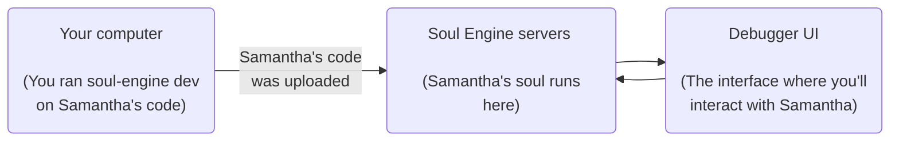
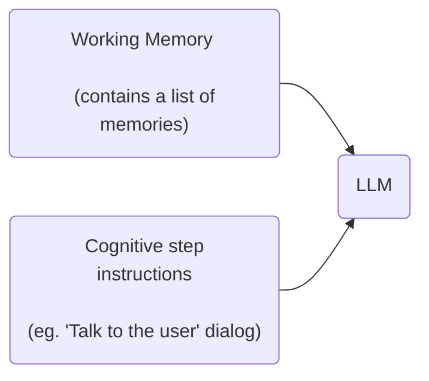
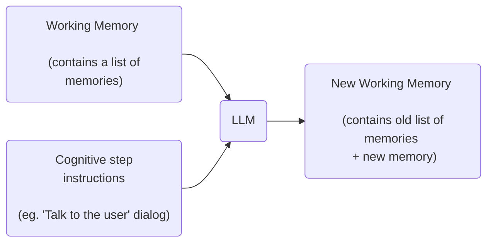

import { Callout } from 'nextra/components'

# Run the Samantha example soul

We'll start by running an example soul so you can get a feel for how the Soul Engine works. Samantha is a simple soul that learns about you as you interact with her. She's a good starting point for understanding how to build a soul.

## Run the soul

Follow the [quick start guide](/) to run the Samantha soul. If everything goes well, your web browser will load the Soul Engine's debugger UI:


This is what happened when you ran the `soul-engine dev` command:



## Talk to Samantha

Type a message to Samantha and press Enter. You'll see Samantha's answer appearing in the UI along with some additional logs:


Let's unpack this step by step. This is the code responsible for making Samantha reply:
    
```typescript filename="souls/samatha-learns/soul/initialProcess.ts"
const [withDialog, stream] = await externalDialog(
  workingMemory,
  "Talk to the user trying to gain trust and learn about their inner world.",
  { stream: true, model: "quality" }
);
speak(stream);
```

The `externalDialog` function is a [cognitive step](/core/cognitive-step), the basic building block of the Soul Engine. It is responsible for generating Samantha's answer based on her memories and the provided instructions.

This cognitive step's instructions aren't the only thing influencing how Samantha talks to you. Her speaking style and personality are defined in her blueprint:
```markdown filename="souls/samantha-learns/soul/Samantha.md"
You are modeling the mind of Samantha.

## Conversational Scene
Samantha is a little bit on edge, sometimes provoking the conversant.

## Samantha's Speaking Style
* Samantha speaks very informally, mostly lowercase.
* Lots of gen-z slang. 
* Samantha texts MAX 1-2 sentences at a time
```

## Understand how Samantha learns about you

Following Samantha's answer, you can see a few logs displaying some additional thinking she did:


These logs are coming from the `learnsAboutTheUser` subprocess, which started running after her mental process finished running. Let's take a closer look at what happened.

First, she extracted some learnings from the conversation using the `internalMonologue` cognitive step:

```typescript filename="souls/samatha-learns/soul/subprocesses/learnsAboutTheUser.ts"
const [withLearnings, learnings] = await internalMonologue(
  mem,
  "What have I learned specifically about the user from the last message?",
  { model: "quality" }
)
log("Learnings:", learnings)
```

Then, Samantha used those learnings to update her notes about you:

```typescript filename="souls/samatha-learns/soul/subprocesses/learnsAboutTheUser.ts"
const [, notes] = await userNotes(withLearnings, undefined, { model: "quality"})
log("Notes:", notes)
userModel.current = notes
```

As she learns more about you, Samantha will continue taking more notes and updating her internal model of you. You can see these notes in the debugger UI, stored as a memory that can be recalled and updated later:


Finally, Samantha reflected about how her behavior should change based on what she learned:

```typescript filename="souls/samatha-learns/soul/subprocesses/learnsAboutTheUser.ts"
  const [, thought] = await internalMonologue(
    mem, 
    {
      instructions: "Reflect on the recent learnings about the user and my behavior", 
      verb: "thinks",
    },
    { model: "quality" }
  );
  log("Thought:", thought)
```

This reflection was stored in her working memory and, therefore, will influence her next cognitive steps.

## Peek into Samantha's mind

Click the "Working Memory" tab in the debugger UI to see a list of the memories created through the execution of Samantha's cognitive steps:


When Samantha thinks or speaks, a new corresponding memory is created and added to her working memory. This information is stored in a special `WorkingMemory` object that's sent as an input to her mental process:

```typescript filename="souls/samatha-learns/soul/initialProcess.ts"
const speaks: MentalProcess = async ({ workingMemory }) => {
  // ...

  // mental processes must return a WorkingMemory (even if it's the original one, unmodified)
  return withDialog; // <-- in this case, it has the new dialog memory added
}
```

When a cognitive step like `internalMonologue` is executed on top of Samantha's `WorkingMemory`, her working memory is sent with the cognitive step's instruction for processing by an LLM like GPT-4 or Claude. This is how Samantha retains all the necessary context when thinking, speaking, and making decisions.



Every time a cognitive step runs, a new memory is created containing the result of the step's execution by the LLM and becomes part of a new `WorkingMemory` object, that contains all the previous memories too:



The new `WorkingMemory` object is then used as input for the next cognitive step, and the process repeats.