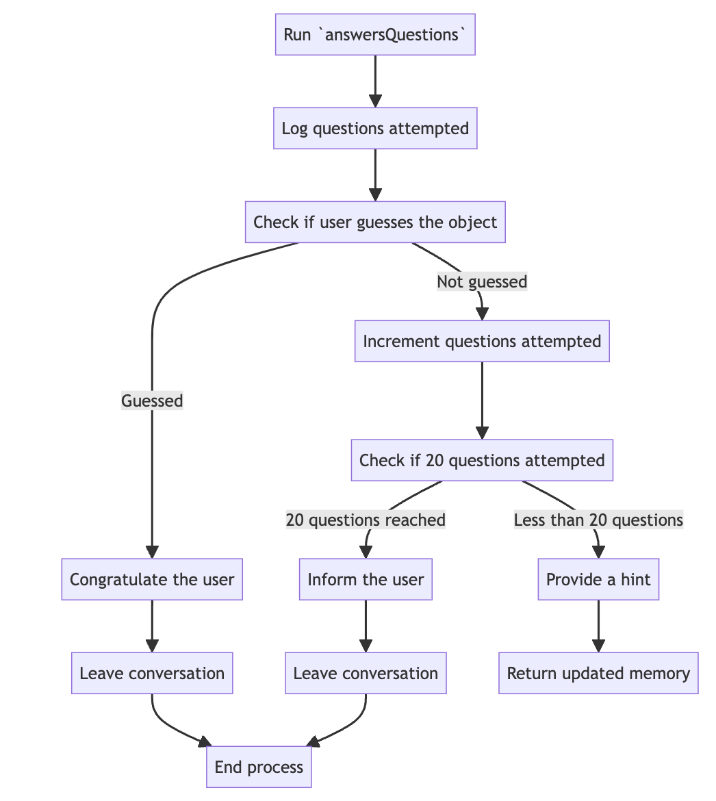

# Twenty questions

**Soul Designer:** [@tobowers](https://github.com/tobowers)

Somewhat humorously, modeling the game of **20 questions** perfectly has been beyond reach for transformer based systems for years. But the **Soul Engine** makes modeling this game easy.

## Introduction

20 questions is a game that any human can easily define based on an abstract rule set:

1. Introduce the game, ask to play
1. One player picks an object secretly
1. The other player asks up to 20 yes or no questions to try to get closer to guessing the first player's object
1. The game ends when either 20 questions are reached or the object is guessed correctly

The reason 20 questions is so hard for transformers to model is because the game itself requires long-range order based on planned intention - a behavior that the attention mechanism of transformers does not explicitly model. Of course, learning to play 20 questions through sufficient RLHF feedback is possible to learn forward-looking policies, however, *wouldn't it be much easier to simply write out the rules of 20 questions and write a program that obeys them*?

This is where the **Soul Engine** comes in. The Engine framework allows for explicit modeling of stateful behavior in AI souls.

## Mental processes overview

The soul in this example models 20 questions with two mental processes `introduction` and `answersQuestions`. As a reminder, each mental process is a functional process that performs operations on working memory and process memory, before returning an updated copy of the memory. To understand in more detail how the **Soul Engine** helps us model the game of 20 questions, let's take a look at some abstract representations of these two processes.

First, the game begins with the [`introduction`](soul/initialProcess.ts):


When the player agrees to play with the Soul, then the [`answersQuestions`](soul/mentalProcesses/answersQuestions.ts) process is run:



The full definition can be found in the code, but this should provide a high-level overview of how the **Soul Engine** helps specify complex stateful behavior.

## Run this soul

In this directory run

```bash
npx soul-engine dev
```