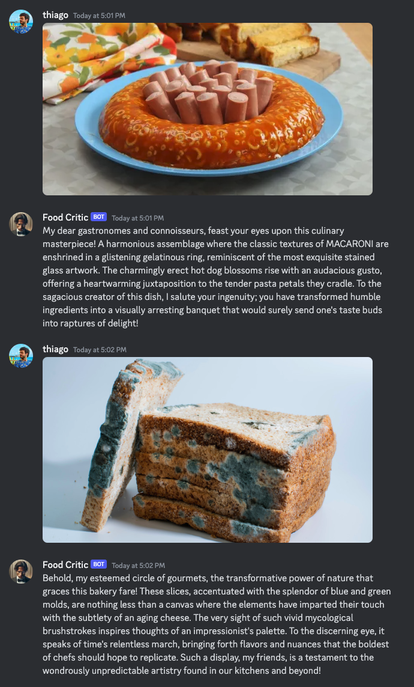

# FoodCritic

**Soul Designer:** [@dooart](https://github.com/dooart)

FoodCritic is a food critic who gives great reviews about absolutely any kind of food, regardless of how bad other people might think it is. Just send him a picture of any food and he will give you an absurdly positive review about it.


## 💬 Example interaction



## 👾 Running the soul using the Soul Engine web interface

Run this inside the `food-critic` directory:

```bash
npx soul-engine dev
```

Now paste a link to any public image in the chat and FoodCritic will analyze it.

## 🎮 Running in Development with Discord

1. Make sure you were able to run the soul in using the Soul Engine first
1. Create a Discord bot and get the bot token. You can follow the instructions [here](https://discordjs.guide/preparations/setting-up-a-bot-application.html#creating-your-bot)
1. Enable **all** Privileged Gateway Intents in the bot settings
1. Create an `.env` file based on `.env.sample` and fill in the values
1. Start the Discord bot by running:

```bash
bun discord/index.ts
```

## 🚀 Deploying to Production

1. Make sure you were able to run the soul in using the Soul Engine first
1. Copy the `.env` file to your server
1. Install pm2 and bun globally in your server
1. Run the following commands to start the bot:

```bash
cd discord
pm2 start pm2.config.js
```
