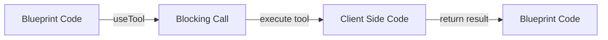

# Tools

The Soul Engine supports [client side tool use](/blueprints/hooks/useTool). Tools are used through blocking calls (using async/await) from blueprint code to your [client code](/souls). That is, blueprint code executed on the soul engine can call out to functions defined in your client code. These functions can do arbitrary actions and return a (serializable) response back to your blueprint code.

Tool use is not a replacement for [InteractionRequests and Perceptions](./perceptionAndInteractionRequest) but is a very useful companion for actions that are relatively quick (30s timeout) and make sense to do inline with your soul's mental processes..

## Example Usecases
* creating calendar appointments
* opening a page in the browser
* playing a sound effect
* clicking somewhere

For a reference on how to use tools see [useTool](/blueprints/hooks/useTool)
