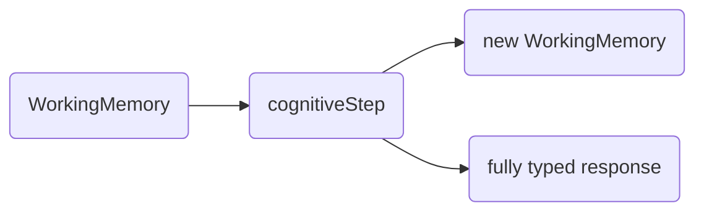

# Open Souls Core

> Working Memory for AI Souls

[The Open Souls core library](https://www.npmjs.com/package/@opensouls/core) provides developers with straightforward and powerful tools for guiding the cognitive processes of large language models (LLMs), making it simpler to craft more dynamic and compelling AI souls.

The open source library offers WorkingMemory and cognitiveSteps for managing context. Each cognitiveStep operates on WorkingMemory, treating every interaction as a distinct transformation. This method ensures a structured and coherent progression of context, allowing for a more predictable and streamlined way to navigate an AI souls thought process. The result is a more consistent and intuitive interaction flow.

The core concepts of the library are:
* [`WorkingMemory`](./core/working-memory) - a collection of [Memory](working-memory#the-memory-interface) objects that provides [lots of ways](list-manipulation) to immutably transform memory.
* [`cognitiveStep`](./core/cognitive-step) - a function that transforms a WorkingMemory, adds to its memories, and returns a response. You can think of these functions as thinking, speaking, noticing, etc.
* `processor` - a class for calling out to an LLM and fetching a response.

At its most basic, you perform a [CognitiveStep](./cognitive-step) on a `WorkingMemory` and receive both a fully-typed response (based on the schema of your cognitiveStep) and a new `WorkingMemory` 



[CognitiveStep](./cognitive-step)s use a `processor` to call out to a model that provides reasoning capabilities. OpenAI (and all compatible AIs) as well as Anthropic are supported directly in the library.

import { Callout } from 'nextra/components'

<Callout type="info" emoji="ℹ️">
  Many pre-built cognitiveSteps are available in our [community library!](https://github.com/opensouls/soul-engine/tree/main/community)
</Callout>

## Simple Example

Using WorkingMemory and cognitive steps can be thought of as building up a set of memories, and then performing functional, append-only manipulations on those memories. Here is a simple example that initializes a WorkingMemory with memories of being a helpful AI assistant and applies a cognitive step to process new messages.

```ts
import { WorkingMemory, ChatMessageRoleEnum, Memory } from "@opensouls/core";
import { externalDialog } from "./lib/cogntiveSteps.js";

// Initialize WorkingMemory with initial memories
let workingMemory = new WorkingMemory({
  soulName: "A Helpful Assistant",
  memories: [
    {
      role: ChatMessageRoleEnum.System,
      content: "You are modeling the mind of a helpful AI assistant",
    },
  ],
});

// Then, during an event loop, withReply(...) would be called with a memory of each new message:
async function withReply(workingMemory: WorkingMemory, newMessage: Memory): Promise<WorkingMemory> {
  // externalDialog is a cognitiveStep defined in another function.
  const [updatedMemory, response] = await externalDialog(workingMemory, newMessage);
  console.log("AI:", response);
  return updatedMemory;
}
```

<Callout type="info" emoji="ℹ️">
  Many more examples on the [learn-by-example page](./core/learn-by-example)
</Callout>