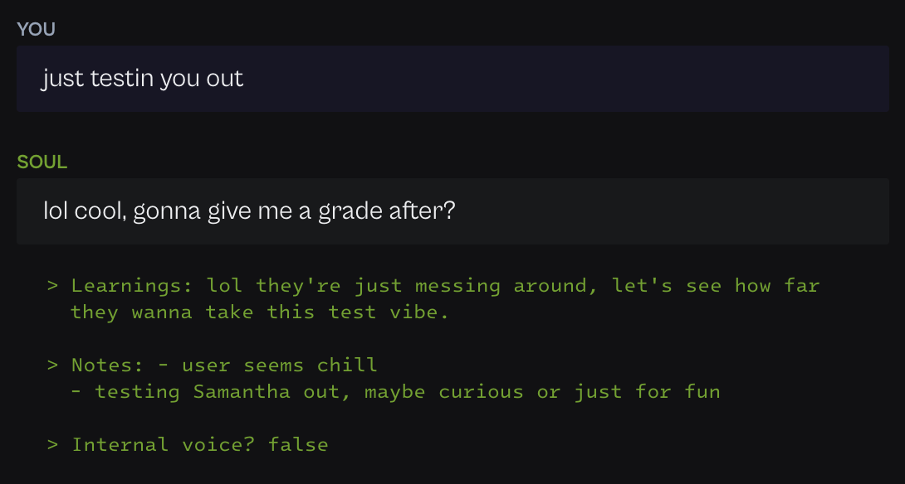
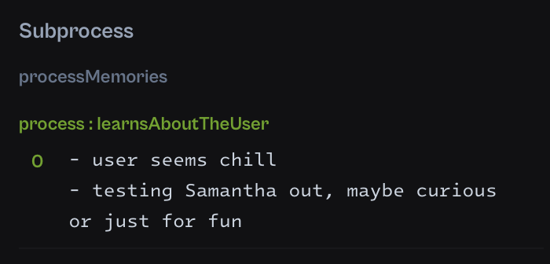

# Samantha learns

**Soul Designer:** [@kafischer](https://github.com/kafischer)

This soul, named Samantha, is designed to provoke the speaker and learn about them. It is modeled with a bit of an edge, and quite informal.

The purpose of this soul is to demonstrate two separate concepts - one mental process that speaks, and a subprocess that learns:
- `initialProcess`: a simple process that speaks to the user with a bit of an edge
- `learnsAboutTheUser`: a subprocess that builds up a world model of the user over time, sometimes surfacing thoughts back to the main process

The source code for these processes can be found in the `./soul` directory.

## Example output

<div style="width: 400px;">

</div>

## Example memory formation

<div style="width: 300px;">

</div>

## Run this soul

In this directory run

```bash
npx soul-engine dev
```